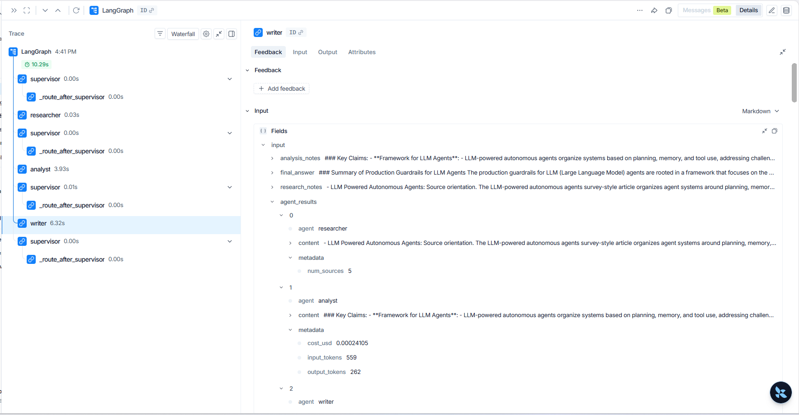

# Design: Multi-Agent Research System

> Điền dựa trên implementation thật trong `src/multi_agent_research_lab/` và số liệu benchmark thật trong `reports/benchmark_report.md`. Chi tiết từng quyết định thiết kế (kèm code, lý do, bug phát hiện khi implement) xem `docs/solution_walkthrough.md`.

## Problem

Xây dựng một research assistant nhận một câu hỏi nghiên cứu dạng tự do (ví dụ: *"Research GraphRAG state-of-the-art and write a 500-word summary"*), cần:

1. Tìm nguồn thông tin liên quan đến câu hỏi.
2. Phân tích, đối chiếu các nguồn để rút ra luận điểm chính và bằng chứng yếu.
3. Viết câu trả lời cuối cùng, có trích dẫn tường minh (`[1]`, `[2]`, ...) tới từng nguồn.

Hệ thống phải so sánh được hai cách tiếp cận trên cùng một tập câu hỏi: **single-agent baseline** (một lệnh gọi LLM duy nhất) và **multi-agent workflow** (Supervisor điều phối Researcher → Analyst → Writer), bằng số liệu latency/cost/citation coverage/failure rate — không chỉ nhìn output "có vẻ ổn".

## Why multi-agent?

Single-agent baseline **không có bước tìm nguồn** — nó chỉ trả lời từ kiến thức nội tại của model, không thể trích dẫn nguồn cụ thể. Với các câu hỏi yêu cầu grounding/verifiability (đúng use case của lab: research report có trích dẫn), đây là giới hạn cấu trúc, không phải vấn đề prompt engineering.

Số liệu benchmark thật (`reports/benchmark_report.md`, 3 query trong `configs/lab_default.yaml`, chạy qua cả 2 chế độ):

| Chỉ số | Single-agent (trung bình 3 run) | Multi-agent (trung bình 3 run) |
|---|---:|---:|
| Latency | ~7.0s | ~14.8s (~2.1×) |
| Cost | ~$0.00023 | ~$0.00067 (~2.9×) |
| Citation coverage | *(không đo được — luôn `None`)* | 60–100% |
| Failure rate | 0% | 0% |

Kết luận rút ra: multi-agent **luôn chậm hơn và tốn hơn** — đúng chiều với working thesis của corpus offline (topic 1, `T01-SYN-A`: *"structured mechanisms improved evidence coverage by 11–18% nhưng token cost tăng 22–41%"*) — nhưng đổi lại có khả năng trích dẫn nguồn mà single-agent không thể có được về mặt cấu trúc. Đây là một đánh đổi có điều kiện (conditional trade-off), không phải "multi-agent luôn tốt hơn":

- **Nên dùng multi-agent** khi: câu hỏi cần grounding/citation, cần kiểm chứng chéo bằng chứng, hoặc task có nhiều sub-topic độc lập đáng để tách vai trò xử lý.
- **Không nên dùng multi-agent** khi: câu hỏi ngắn, một nguồn thông tin rõ ràng, không cần trích dẫn, ưu tiên latency/cost thấp — single-agent baseline thắng về mọi mặt trong trường hợp đó (khớp case study `CASE-01-B` của corpus: *"A six-agent pipeline repeats the same source extracts and spends most of its time on handoffs and synthesis"*).

## Agent roles

| Agent | Responsibility | Input | Output | Failure mode |
|---|---|---|---|---|
| **Supervisor** | Quyết định worker kế tiếp dựa trên field nào của `ResearchState` còn thiếu; enforce `max_iterations`; fallback khi worker trước lỗi | `ResearchState` hiện tại (`sources`, `analysis_notes`, `final_answer`, `errors`) | Route mới ghi vào `route_history` + trace event `supervisor.route` | Vòng lặp không dừng nếu thiếu guard — **đã chặn** bằng kiểm tra `state.iteration >= max_iterations` là điều kiện đầu tiên trong `_decide()`, verify bằng cách giả lập "mọi worker treo" và xác nhận dừng đúng ở lần lặp thứ 7 |
| **Researcher** | Tìm & xếp hạng nguồn liên quan (đọc kho corpus offline), viết `research_notes` | `request.query`, `request.max_sources` | `sources` (kèm `match_score`), `research_notes` | Không tìm được nguồn liên quan → ghi vào `state.errors`, **không raise** — để Supervisor tự quyết định fallback thay vì làm sập workflow |
| **Analyst** | Trích luận điểm chính từ `research_notes`, gắn cờ bằng chứng yếu, so sánh quan điểm trái chiều | `research_notes`, `sources` | `analysis_notes` | Thiếu `research_notes` (do Researcher lỗi) → guard, ghi lỗi, không gọi LLM lãng phí |
| **Writer** | Tổng hợp `analysis_notes` thành câu trả lời cuối, **bắt buộc** trích dẫn `[n]` khớp với `sources` | `analysis_notes` (fallback `research_notes` nếu Analyst bị bỏ qua) | `final_answer` | Không có notes nào để viết → ghi lỗi; model bịa nguồn/bỏ sót trích dẫn → không tự phát hiện được (xem `docs/failure_mode_analysis.md`) |
| **Critic** *(bonus, không mặc định nằm trong route)* | Đọc `final_answer` + `sources`, liệt kê claim không có bằng chứng và nguồn bị liệt kê nhưng không trích | `final_answer`, `sources` | Ghi chú review vào `agent_results` | Tăng thêm 1 lệnh gọi LLM (cost + latency) mỗi lần bật — quyết định bật hay không là đánh đổi cost/quality tường minh, không mặc định "càng nhiều agent càng tốt" |

## Shared state

`ResearchState` (`core/state.py`) là single source of truth duy nhất truyền qua mọi agent — không agent nào giữ state riêng:

| Field | Lý do cần |
|---|---|
| `request: ResearchQuery` | Input gốc đã validate (Pydantic: `query` ≥5 ký tự, `max_sources` 1-20) — chặn input rác ngay từ đầu, trước khi tốn 1 lệnh gọi LLM/search nào |
| `iteration`, `route_history` | Cho phép Supervisor enforce `max_iterations` và cho phép debug: đọc `route_history` biết chính xác thứ tự agent nào đã chạy |
| `sources`, `research_notes` | Ngăn cách bằng chứng thô (`sources`, có `match_score`/`source_id` để trace provenance) khỏi diễn giải (`research_notes`) — đúng nguyên tắc "tách evidence khỏi hypothesis" mà corpus offline nhấn mạnh |
| `analysis_notes` | Sản phẩm trung gian của Analyst — tách riêng khỏi `final_answer` để Writer có thể fallback về `research_notes` nếu bước Analyst bị bỏ qua (fallback path) |
| `final_answer` | Kết quả cuối cùng trả cho người dùng |
| `agent_results: list[AgentResult]` | Ghi lại `cost_usd`/`input_tokens`/`output_tokens` từng agent — dữ liệu thô để `evaluation/benchmark.py` tính `estimated_cost_usd` |
| `trace: list[dict]` | Sự kiện nghiệp vụ (`researcher.done`, `analyst.done`...) **và** sự kiện thời gian (`node.<tên>.timing`, `workflow.done`) — trả lời cả "ai làm gì" lẫn "tốn bao nhiêu thời gian" cho rubric "Trace explanation" |
| `errors: list[str]` | Kênh báo lỗi "mềm" — agent ghi lỗi vào đây thay vì raise exception, để Supervisor đọc và fallback thay vì làm sập cả workflow |

## Routing policy

```text
                     ┌── Supervisor ──┐
                     │  (đọc state,   │◄────────────┐
                     │  chọn route)   │              │
                     └───────┬────────┘              │
        ┌────────────┬──────┴───────┬────────────┐   │
        ▼            ▼              ▼            ▼   │
     researcher    analyst        writer        done │
        │            │              │                │
        └────────────┴──────────────┴────────────────┘
     (mỗi worker luôn quay lại Supervisor, không gọi lẫn nhau)
```

Chính sách routing là **state-machine dựa trên field còn thiếu** (deterministic), không phải một LLM tự quyết định route:

```
state.iteration >= max_iterations                       → done   (guardrail, kiểm tra đầu tiên)
state.errors và có research_notes nhưng chưa final_answer → writer (fallback, bỏ qua analyst)
chưa có sources                                          → researcher
có sources, chưa có analysis_notes                       → analyst
có analysis_notes, chưa có final_answer                  → writer
đã có final_answer                                       → done
```

**Vì sao chọn deterministic thay vì LLM router:** rẻ (không tốn token chỉ để quyết định "đi đâu tiếp"), test được mà không cần mock LLM (`tests/test_supervisor.py`, 7 test case), và dễ debug qua `route_history`. Đánh đổi: kém linh hoạt hơn — ví dụ không tự quay lại Researcher nếu Analyst phát hiện bằng chứng còn thiếu. Đây là hướng nâng cao hợp lý nếu muốn mở rộng.

Được lắp ráp thành graph thật bằng LangGraph (`graph/workflow.py::MultiAgentWorkflow`) — Supervisor là node trung tâm duy nhất có cạnh điều kiện (`add_conditional_edges`), mọi worker chỉ có một cạnh cố định quay lại Supervisor.

**Bằng chứng trace thật** (LangSmith, query *"Summarize production guardrails for LLM agents"*, tổng 10.29s) — đúng khớp thứ tự route ở trên: `supervisor → researcher (0.03s) → supervisor → analyst (3.93s) → supervisor → writer (6.32s) → supervisor → done`. `analyst`/`writer` chiếm gần hết thời gian vì đó là 2 bước gọi LLM thật; `researcher` nhanh vì chỉ tra cứu corpus offline, không gọi mạng.



## Guardrails

- **Max iterations:** `Settings.max_iterations = 6` (env `MAX_ITERATIONS`), enforce là điều kiện **đầu tiên** trong `SupervisorAgent._decide()` — độc lập với logic nghiệp vụ bên dưới, nên vẫn dừng đúng kể cả khi mọi worker khác lỗi. Verified bằng cách giả lập "không worker nào bao giờ cập nhật state" → `route_history` dừng đúng ở lần lặp thứ 7.
- **Timeout:** `Settings.timeout_seconds = 60` (env `TIMEOUT_SECONDS`), truyền vào `timeout=` của mỗi lệnh gọi OpenAI trong `LLMClient.complete()`.
- **Retry:** `@retry(stop=stop_after_attempt(3), wait=wait_exponential(min=1, max=8), reraise=True)` (thư viện `tenacity`) bọc quanh `LLMClient.complete()` — chống lỗi mạng/rate-limit tạm thời, đặt ở tầng service (một chỗ duy nhất) thay vì lặp lại trong từng agent.
- **Fallback:** nếu `state.errors` không rỗng nhưng `research_notes` đã có và chưa có `final_answer` → Supervisor route thẳng tới `writer`, bỏ qua `analyst` — trả lời ở chất lượng suy giảm thay vì không trả lời gì.
- **Validation:** `ResearchQuery` (Pydantic) chặn `query` <5 ký tự và `max_sources` ngoài [1, 20] ngay ở input, trước khi tốn bất kỳ lệnh gọi nào; mỗi worker guard input rỗng của riêng nó (`sources` rỗng, `research_notes`/`analysis_notes` rỗng) trước khi gọi service.

## Benchmark plan

**Query** (từ `configs/lab_default.yaml::benchmark.queries`, chạy qua CLI `benchmark`):

1. *"Research GraphRAG state-of-the-art and write a 500-word summary"*
2. *"Compare single-agent and multi-agent workflows for customer support"*
3. *"Summarize production guardrails for LLM agents"*

**Metric** (`evaluation/benchmark.py::run_benchmark`, mỗi query × mỗi chế độ là 1 hàng trong report):

| Metric | Cách đo | Expected outcome |
|---|---|---|
| Latency | wall-clock (`perf_counter`) | Multi-agent chậm hơn single-agent (nhiều lệnh gọi LLM tuần tự hơn) |
| Cost | tổng `cost_usd` từ `agent_results[].metadata` | Multi-agent tốn hơn single-agent (3-4 lệnh gọi LLM thay vì 1) |
| Citation coverage | tỉ lệ `[n]` xuất hiện trong `final_answer` khớp số `sources` | Single-agent luôn `None` (không có `sources`); multi-agent >0% nếu Writer tuân thủ prompt |
| Failure rate | `1.0` nếu runner raise exception hoặc `state.errors` không rỗng, `0.0` nếu không | Kỳ vọng 0% với corpus offline (không phụ thuộc mạng/API tìm kiếm bên ngoài) |
| Quality | rubric 0-10, **con người chấm** (`docs/peer_review_rubric.md`), không tự động tính | Chưa điền — cần buổi peer review |

**Kết quả thật** (`reports/benchmark_report.md`, 6 run, 0 failed, latency trung bình 10.89s, tổng cost $0.0027) khớp đúng expected outcome ở trên: multi-agent chậm hơn (~2.1×) và tốn hơn (~2.9×) nhưng có citation coverage 60-100% mà single-agent không có được về mặt cấu trúc. Xem bảng đầy đủ trong chính file report.
